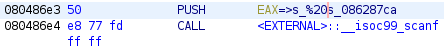

# Angr-y Binary

## Introduction

This challenge is a 155 point reversing problem. The description reads:

> Why waste time creating multiple functions, when you can just use one? Can you
> find the path to the flag in this angr-y binary?

The title and description are probably hints to use `angr`.

## Information Gathering

We didn't have any hints.

### Dynamic Analysis

When we ran the program, we were prompted for a password before the program
terminated.

```sh
$ ./angr-y_binary
Enter a valid password:
test
Oops, no flag for you!
```

### Static Analysis

Not that it really matters for an RE challenge, but:

```sh
checksec ./angr-y_binary
    Arch:     i386-32-little
    RELRO:    Partial RELRO
    Stack:    Canary found
    NX:       NX enabled
    PIE:      No PIE (0x8048000)
```

We then loaded the program up in Ghidra. The file took forever to analyze,
given that it's 5.9MB. We even got the error "Low-level Error: Flow exceeded
maximum allowable instructions" in Ghidra's decompiler. We tried increasing the
maximum number of instructions and allowable size of the decompiled function,
but then we got an out of memory error...


We opened the program up in Binary Ninja. It failed to analyze a few functions
complaining about exceeding maximum function size.

```txt
Skipping analysis for function at 0x804865f : Exceeds
'analysis.limits.maxFunctionSize'
Skipping analysis for function at 0x804865f : Exceeds
'analysis.limits.maxFunctionSize'
Skipping analysis for function at 0x804865f : Exceeds
'analysis.limits.maxFunctionSize'
```

While we could have forced analysis, we didn't think it was important. We
noticed the symbol `print_flag` and examined that instead. The function
decompiled to the following:

```c
08048596  int32_t print_flag()

08048596  {
080485a8      void* gsbase;
080485a8      int32_t eax = *(int32_t*)((char*)gsbase + 0x14);
080485db      void var_50;
080485db      fgets(&var_50, 0x40, fopen("flag.txt", "r"));
080485ea      puts(&var_50);
080485f6      int32_t eax_3 = (eax ^ *(int32_t*)((char*)gsbase + 0x14));
080485fd      if (eax_3 == 0)
080485f6      {
08048608          return eax_3;
08048608      }
080485ff      __stack_chk_fail_local();
080485ff      /* no return */
080485ff  }
```

So we know that our target is `print_flag`. We can use `angr` to find the path
to the flag. The program takes input via a call to `scanf(%20s)` so we can pass
in up to 20 characters, excluding the null terminator which is added by
`scanf`. The null terminator is important to think about because we're going to
have to create a symbolic bitvector of the same length as the string in `angr`.



To recap, we know:

* The starting point of the program (`main`)
* The place we want to end up at (`print_flag`)
* The length of the input (`20`)

We tell this to `angr` in the `get_password` function inside of `solve.py`. and
eventually arrive at a valid password (there are at least a couple):
`wgIdWOS6Df9sCzAfiK\xd0\x01`.

## The Flag

Passing this password to the program, we get the flag. If you're doing this
locally you will first need to create the file manually.

```sh
$ ./angr-y_binary
Enter a valid password:
wgIdWOS6Df9sCzAfiK\xd0\x01
247CTF{a3bbb9d2e648841d99e1cf4535a92945}
```

You can also use the included solution script as well as follows:

```python
python3 ./solve.py
# REMOTE probably won't work for you as the server is spun up for each person.
python3 ./solve.py REMOTE
```
