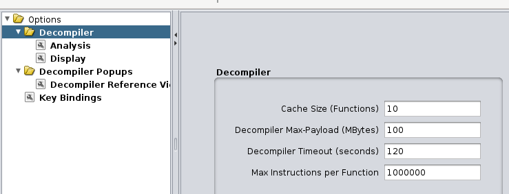
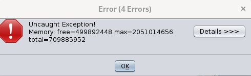

# Angr-y Binary

## Introduction

This challenge is a 155 point reversing problem. The description reads:

> Why waste time creating multiple functions, when you can just use one? Can you
> find the path to the flag in this angr-y binary?

The title and description are probably hints to use `angr`.

## Information Gathering

We didn't have any hints.

### Dynamic Analysis

When we ran the program, we were prompted for a password before the program terminated.

```sh
$ ./angr-y_binary
Enter a valid password:
test
Oops, no flag for you!
```

### Static Analysis

Not that it really matters for an RE challenge, but:

```sh
checksec ./angr-y_binary
    Arch:     i386-32-little
    RELRO:    Partial RELRO
    Stack:    Canary found
    NX:       NX enabled
    PIE:      No PIE (0x8048000)
```

We then loaded the program up in Ghidra. The file took forever to analyze, given that it's 5.9MB. We even got the error "Low-level Error: Flow exceeded maximum allowable instructions" in Ghidra's decompiler. We tried increasing the maximum number of instructions and allowable size of the decompiled function, but then we got an out of memory error...



