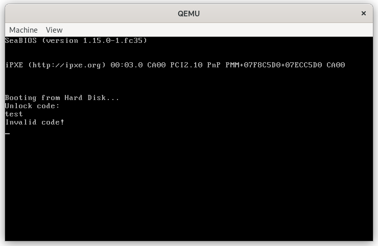

# The Flag Bootloader

## Introduction

This is a 150 point reversing challenge from 247CTF. The description states:

> Can you unlock the secret boot sequence hidden within our flag bootloader to recover the flag?

We are given `flag.com`, a boot sector.

```sh
file ./flag.com
./flag.com: DOS/MBR boot sector
```

## Dynamic Analysis

When we launch the boot sector with qemu, we are prompted for a password.

```sh
qemu-system-x86_64 -drive format=raw,file=./flag.com
```



We can then debug the boo sector with gdb by adding the `-S` and `-s` flags:

```sh
qemu-system-x86_64 -drive format=raw,file=./flag.com -s -S
```
