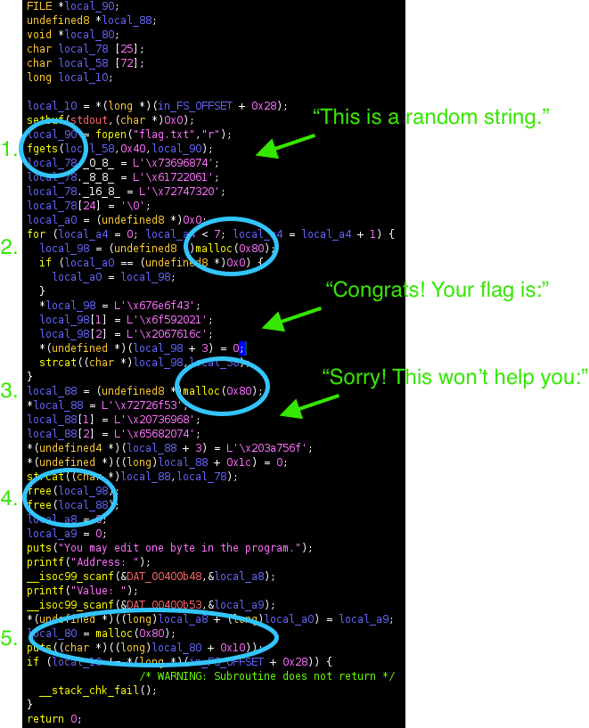
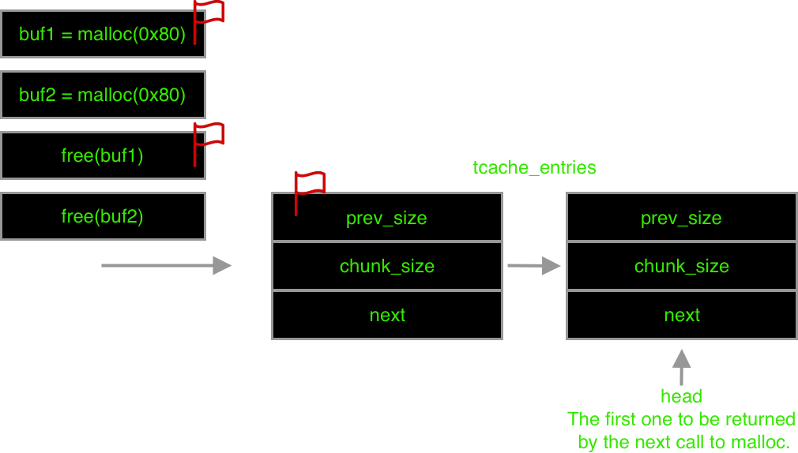
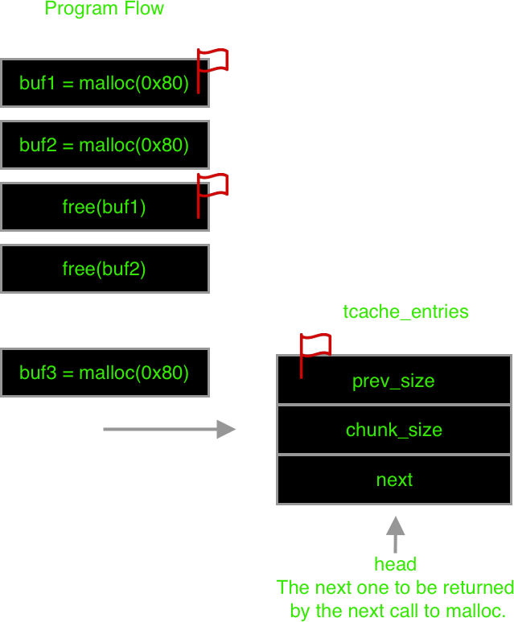

# Cache Me Outside

## Introduction

Cache me Outside is the second challenge in the binary exploitation category.
The description states:

> While being super relevant with my meme references, I wrote a program to see
how much you understand heap allocations. nc mercury.picoctf.net 34499 heapedit
Makefile libc.so.6

## Information Gathering

### Hint #1

> It may be helpful to read a little bit on GLIBC's tcache.

Before I looked at this challenge, I had no idea what the tcache was. Having
only read through it a couple times, I would do a much poorer explanation than
the blogs I found [here][azeria] and [here][nightmare]. Essentially, the tcache is
one of five types of bins that the heap manager keeps track of. The tcache is a
per-thread cache that is used to immediately service an allocation without
needing to wait on a heap lock when a thread requests memory. When a chunk of
memory is freed, providing it it not null and is a valid address, it will be
placed in the tcache if it fits (otherwise it could be `munmmap`'ed or stored
in a different bin tracked by the heap manager). If we later request a chunk of
the same size, we will retrieve the one we `free`'d earlier. This is where
things could get hairy because the data at those memory location aren't erased,
they are just marked as free for use. So if we have the ability to look into
the tcache, we might see data that the developer didn't want us to see.

### Running the Program

We did not get source code for the challenge. We instead got the compiled amd64
executable, a copy of `libc` that is was linked against, and the Makefile. When
we tried to execute the program we got an error:

```bash
$ ./heapedit
Inconsistency detected by ld.so: dl-call-libc-early-init.c: 37:
_dl_call_libc_early_init: Assertion `sym != NULL' failed!
```

We got this error because the dynamic linker that was used to link this version
of libc does not exist on our host. The solution then was to grab the correct
version. Knowing the naming convention of libraries and the current version of
libc (2.33 on our host), we `grep`ed for the version:

```bash
$ strings libc.so.6 | grep "2.2"
...
GNU C Library (Ubuntu GLIBC 2.27-3ubuntu1.2) stable release version 2.27.
libc-2.27.so
```

Cool, we found out it was 2.27. Now we need to grab that version. We downloaded
it from a random GitHub account (which probably is not a great idea?), but left
the link out for reasons. Alternatively, we cheated a bit and looked at a
fantastic [writeup][writeup] and learned about `pwninit` which allowed us to
download the correct version automatically.

```bash
$ pwninit
bin: ./heapedit
libc: ./libc.so.6

fetching linker
unstripping libc
warning: failed unstripping libc: failed running eu-unstrip, please install
elfutils: No such file or directory (os error 2)
setting ./ld-2.27.so executable
running patchelf on ./heapedit_patched
```

We ran it again with the correct linker and provided version libc (you can also
LD_PRELOAD these instead of using `pwninit`, but I really like it so far).
However, we ran into a segmentation fault:

```bash
$ ./heapedit
qemu: uncaught target signal 11 (Segmentation fault) - core dumped
Segmentation fault (core dumped)
```

I had to use QEMU in this case because I'm running an ARM VM, so this is likely
not needed for others. Running QEMU with the `--strace` option showed us that
the fault was a bad read when trying to `open flag.txt`:

```bash
$ qemu-x86_64-static --strace ./heapedit
...
26026 openat(-100,"flag.txt",O_RDONLY) = -1 errno=2 (No such file or directory)
--- SIGSEGV {si_signo=SIGSEGV, si_code=1, si_addr=NULL} ---
```

We `echo`ed some random data into a new file called `flag.txt`. When we reran
the program, it worked as intended. Whew, that was a lot of effort to just get
the executable running. When we ran the program, this is what we got:

```text
$ ./heapedit
You may edit one byte in the program.
Address: 40000
Value: test
t help you: this is a random string.
```

### Ghidra

Since we were not provided with source code, Ghidra seemed like a good first
step. This was the disassembly after some markup:



There are some key parts.

1. The program reads the flag into a buffer on the stack.
1. The program then calls `malloc` seven times and `strcat`'s the flag into
each buffer. The pointer to the first buffer is saved.
1. Allocates another buffer and `strcat`'s the string "Sorry! This won't help
you: This is a random string." into it.
1. The first buffer allocated in step 2 is `free`'d alongside the buffer in
step 3.
1. The program asks for user input and modifies an offset of an address to the
user provided value. A final buffer is allocated and its contents are printed
to the terminal.

We noticed when we ran the program that we got the output "t help you: this is
a random string." We got this value because the pointer to this string was the
last to be `free`'d. When our program requested additional memory that could be
immediately serviced by the tcache, the heap manager simply returned that
pointer. If the program called `malloc` a second time, we would actually have
the pointer to our flag because it was `free`'d just before and would be next
in the tcache.

We hypothesized that one way of solving this challenge was to somehow swap the
tcache entries, such that the address of the flag would be the first
serviceable address in the tcache and returned on `malloc`. However, the
program only allowed us to edit one byte in memory. With this, we could locate
the head of the tcache, find the entry that contained the pointer to the random
string, and then change it to the entry that points to the flag. This got
confusing so we made this rough diagram of what was happening in the program:

The state of the program after the two calls to `free` have occurred:



The state of the program after the last call to `malloc`:



We created a breakpoint at the call to `free` and examined the arguments passed
to it. The first time the argument was 0x603800, which pointed to our flag. The
second call to `free` passed in 0x603890, the pointer to the random string.
When these got `free`'d, both chunks ended up in the tcache. As a
last-in-first-out structure, the next call to `malloc` would give the program
the last address passed to `free`, the pointer to our random string. This is
why the program gave us the output `t help you: this is a random string.` We
instead wanted the first tcache entry to be our flag, such that when `malloc`
was called, it would instead receive the pointer to our flag.

This is where we edit one byte of the program. We searched for the head of the
tcache (see the included `heapedit.gdb` script) by examining the heap for the
first pointer the head should contain, the pointer to our random string. We did
this in the debugger with the command `find 0x0000000000600000,
0x0000000000700000, 0x603890` after the second call to `free` had completed.
The address returned from this search was the head of our tcache (0x602088). We
experimented by setting this value in our debugger to the address of our flag.
When we did this and entered 0 for both prompts in the program, we got the flag.

This same approach would work if the program allowed us to edit any arbitrary
byte with just an address. Instead, it allows us to edit an arbitrary address
using an offset from the very first buffer that it initializes, which was at
address 0x6034a0. We can subtract this from our target address yielding the
offset:

0x602088 - 0x6034a0 = -5144. So this was our offset.

For our value, we learned that we needed to change the address from the random
string (0x603890) to our flag (0x603800), which involves setting the lower part
of the address to zero. So our value should be zero. We couldn't just enter 0
on the command prompt though, because that would be interpreted as 0x30. We
wrote up a pwntools script to send a null byte (see `solve.py`). The first part
of the string was overwritten because the address was `free`d and reinitialized.

Entering these values gave us the flag:

```shell
👓:cache-me-outside $ ./solve.py
[+] Opening connection to mercury.picoctf.net on port 34499: Done
-5144
b'lag is: picoCTF{ea0e7e8e8c7bf85caa6601f3dae7ce26}\n'
[*] Closed connection to mercury.picoctf.net port 34499
```

[azeria]: https://azeria-labs.com/heap-exploitation-part-2-glibc-heap-free-bins/
[nightmare]: https://azeria-labs.com/heap-exploitation-part-2-glibc-heap-free-bins/
[writeup]: https://github.com/Dvd848/CTFs/blob/master/2021_picoCTF/Cache_Me_Outside.md
