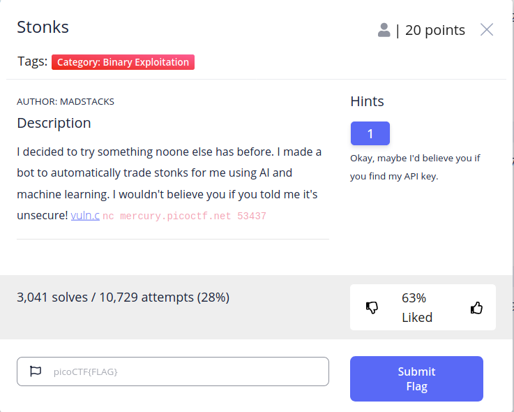

# Stonks

## Introduction
Stonks is the first challenge for Binary Exploitation. The description says: "I decided to try something noone [sic] else has before. I made a bot to automatically trade stonks for me using AI and machine learning. I wouldn't believe you if you told me it's unsecure! vuln.c `nc mercury.picoctf.net 53437`" 



## Information Gathering

### Hint 1
> Okay, maybe I'd believe you if you find my API key.

Just one hint this time! Yikes! API stands for application programming interface. It is used to refer to the standard that defines how two separate component communicate with each other. Think of it like how you receive letter grades in school. You hand in your papers and you receive a grade back. That transaction represents an underlying API. 

In this case, the API key is referring to an alphanumeric string that we can provide this networked application that will tell it who we are. Consider it like a password of sorts - it is unique to certain individuals or projects. 

The hint is telling us to take a look at how the API key is read into the program or maybe the API key is hardcoded to a certain value. We will have to take a look!

### Running the Program
The description tells us how to run the program: `nc mercury.picoctf.net 53437`. The program `nc` is short for `netcat` and is used for all things networking. With it, we can communicate to an existing socket, open our own, or scan ports. Take a look at `man nc` to learn about all of it's common uses (it even has great examples). `nc` typically takes a destination address and a port as an argument. In this case, we are specifying that we would like to connect to `mercury.picoctf.net` over port 53437 using the Transmission Control Protocol (TCP).

Let's try doing this in our terminal:

```
$ nc mercury.picoctf.net 53437
Welcome back to the trading app!

What would you like to do?
1) Buy some stonks!
2) View my portfolio
```

We are met with a prompt asking for a 1 or 2 to perform certain actions. Other characters don't seem to work. Entering `5` for example causes it to tell us "Goodbye!". 

Entering `1` prompts us for out API token:
```
Using patented AI algorithms to buy stonks
Stonks chosen
What is your API token?
```

Entering a short value here seems to work and give us a few stocks that were purchased for us. This ends to program.

Running it again (you will have to terminate the program with Ctrl+C) and choosing the second option shows us our portfolio and exits the program.
```
Portfolio as of Sun Aug  1 22:03:52 UTC 2021


You don't own any stonks!
Goodbye!
```

By playing with the program, we have identified two locations where a user can provide input: selecting 1 or 2 (or really anything else) to select the command and the API key. This is key to finding bugs! It's hard to get a bug where there is no user input. 

But there is more! In the des