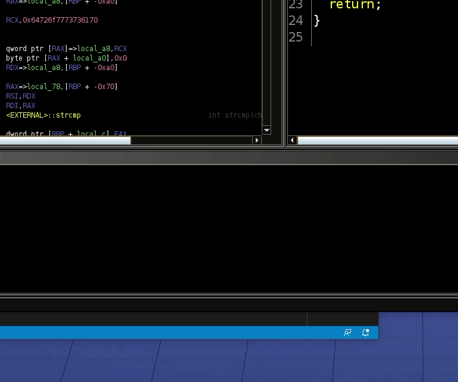

# Password Checker

## Introduction

Password Checker is a warm-up challenge for CSAW 2021 worth 250 points.

> Charlie forgot his password to login into his Office portal. Help him to find
> it. (This challenge was written for the person on your team who has never
> solved a binary exploitation challenge before! Welcome to pwning.)
> nc pwn.chal.csaw.io 5000

We get the executable itself and the address:port to connect to the remote
challenge.

## Information Gathering

### Vulnerability Mitigations

```shell
$ checksec password_checker
    Arch:     amd64-64-little
    RELRO:    Partial RELRO
    Stack:    No canary found
    NX:       NX enabled
    PIE:      No PIE
```

Looks like we have no mitigations in place.

### Static Analysis

We don't have source, so let's throw it into Ghidra. The function `main` simply
calls `password_checker` which has the following source (after some Ghidra
markup I did):

```c
void password_checker(void)

{
void password_checker(void)

{
  char charlies_password [8];
  char local_buf [48];
  char user_input [60];
  int res;

  printf("Enter the password to get in: \n>");
  gets(user_input);
  strcpy(local_buf,user_input);
  charlies_password = L'\x73736170';
  res = strcmp(local_buf,charlies_password);
  if (res == 0) {
    printf("You got in!!!!");
  }
  else {
    printf("This is not the password");
  }
  return;
}
```

It looks like the program takes in user input from stdin via `gets`. This is an
unbounded write onto the stack into our `user_input` buffer that is 60 bytes.
So immediately we have bug. It then sets `charlies_password` to 'password'. It
looks backwards because of how things get written on the stack, but it's really
just 'password'. See GIF below.



It then `strcmp`'s the input we gave it with `charlies_password`. If they match
(the return of `strcmp` is 0 if there is a match), then we get the string 'You
got in!!!!'. Let's try this on the remote server.

```shell
nc pwn.chal.csaw.io 5000l.csaw.io 5000
Enter the password to get in:
>password
You got in!!!!
```

So this works, but we don't get a flag. Looks like we will have to make use of
the unbounded write bug we found earlier. The idea now is to perform a
stack-based buffer overflow that will write shellcode onto the stack (since it
is executable) that will open a shell for us.

Buuuuut, that seems like bit much when the description says it is for someone
who has never done  binary exploitation before. So let's keep looking in
Ghidra. If we search for the string "/bin/sh", Ghidra shows us a function that
references it:

```c
void backdoor(void)

{
  system("/bin/sh");
  return;
}
```

Presto! Now the plan is to overwrite the return address with the address to
this function. Since this is not a position-independent-executable, the address
of the symbol `backdoor` will always be the same. Take a look at the solve
script for how `pwntools` makes this super easy.

## Flag

`flag{ch4r1i3_4ppr3ci4t35_y0u_f0r_y0ur_h31p}`
