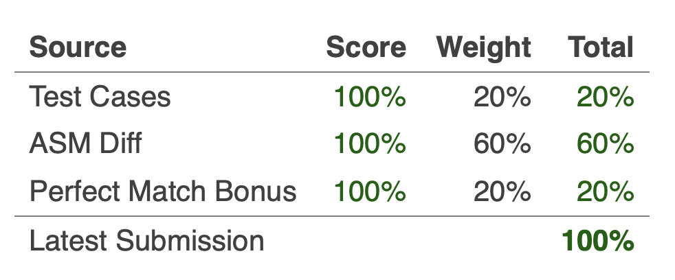

# baby-c

## Introduction

The challenge was to go from the disassembled code to the source code. We were 
given the compiled executable and the assembly via the web console. The 
assembly below was what we needed to match:

```asm
; This is the disassembly you're trying to reproduce.
; It uses Intel syntax (mov dst, src).

main:
  endbr64
  push    rbp
  mov     rbp, rsp
  push    rbx
  sub     rsp, 0x18
  mov     [rbp-0x15], 1
block1:
  mov     rax, [stdin]
  mov     rdi, rax
  call    getc@plt.sec
  mov     [rbp-0x14], eax
  cmp     [rbp-0x14], -1
  je      block7
block2:
  call    __ctype_b_loc@plt.sec
  mov     rax, [rax]
  mov     edx, [rbp-0x14]
  movsxd  rdx, edx
  add     rdx, rdx
  add     rax, rdx
  movzx   eax, [rax]
  movzx   eax, ax
  and     eax, 0x2000
  test    eax, eax
  je      block4
block3:
  mov     rdx, [stdout]
  mov     eax, [rbp-0x14]
  mov     rsi, rdx
  mov     edi, eax
  call    putc@plt.sec
  mov     [rbp-0x15], 1
  jmp     block1
block4:
  cmp     [rbp-0x15], 0
  je      block6
block5:
  mov     rbx, [stdout]
  mov     eax, [rbp-0x14]
  mov     edi, eax
  call    toupper@plt.sec
  mov     rsi, rbx
  mov     edi, eax
  call    putc@plt.sec
  mov     [rbp-0x15], 0
  jmp     block1
block6:
  mov     rbx, [stdout]
  mov     eax, [rbp-0x14]
  mov     edi, eax
  call    tolower@plt.sec
  mov     rsi, rbx
  mov     edi, eax
  call    putc@plt.sec
  jmp     block1
block7:
  mov     eax, 0
  add     rsp, 0x18
  pop     rbx
  pop     rbp
  ret
```

When we looked at the disassembly, we could see that it looped though 
`getc`'ing user input and capitalized the first character. The tricky part was 
the use of the ` __ctype_b_loc@plt.sec` in block 2. This function returns an 
`unsigned short int **` and places the result into `$rax`. The pointer points 
to an array that stores properties of each character. This is used by the 
functions in defined in `ctype.h` such as `isalpha` and `isspace`. I found a 
great guide to the bit mask that each function uses against this properties 
array on [Github][ctype_b_loc] which I've copied below.

```c
v3 = __ctype_b_loc();
printf("isalnum %d\n", (*v3)[s] & 8);
v4 = __ctype_b_loc();
printf("isalpha %d\n", (*v4)[s] & 0x400);
v5 = __ctype_b_loc();
printf("iscntrl %d\n", (*v5)[s] & 2);
v6 = __ctype_b_loc();
printf("isdigit %d\n", (*v6)[s] & 0x800);
v7 = __ctype_b_loc();
printf("isgraph %d\n", (*v7)[s] & 0x8000);
v8 = __ctype_b_loc();
printf("islower %d\n", (*v8)[s] & 0x200);
v9 = __ctype_b_loc();
printf("isprint %d\n", (*v9)[s] & 0x4000);
v10 = __ctype_b_loc();
printf("ispunct %d\n", (*v10)[s] & 4);
v11 = __ctype_b_loc();
printf("isspace %d\n", (*v11)[s] & 0x2000);
v12 = __ctype_b_loc();
printf("isupper %d\n", (*v12)[s] & 0x100);
v13 = __ctype_b_loc();
printf("isxdigit %d\n", (*v13)[s] & 0x1000);
v14 = __ctype_b_loc();
printf("isblank %d\n", (*v14)[s] & 1);
return 0;
```

The assembly of `baby-c` in block2 `and`'s `$eax` against 0x2000. We took this 
to mean that the function was comparing the character to a space, as referenced 
by `isspace` in the table immediately above. Using this, we created the 
following function which gave us 100% match against the test cases for the 
program, though the disassembly didn't match.

```c
#include <stdio.h>
#include <ctype.h>

#define true 1
#define false 0

typedef int bool;

int main(void){
    bool first;
    int n, c;

    first = true;
    while(1){
        if ((c = getc(stdin)) == -1)
            break;

        if (!isspace(c)){
            if (first){
                n = toupper(c);
                first = false;
            }
            else{
                n = tolower(c);
            }
            putc(n, stdout);
        }
        else{
            putc(c, stdout);
            first = true;
        }
    }
}
```


We noticed there were additional calls to `putc@plt` in the assembly, so we
added another call inside each conditional. Additionally, we inspected the `je` 
and
`jmp` instructions and determined that conditional that checked `first` was not
nested inside of the `isspace()` conditional. The result was the assembly below.
This was surprisingly close to the Binary Ninja decompiled result, so we should
have just gone with that :information_desk_person:. Unfortunately, we got the
100% solution after the challenge ended, but it was still fun to figure out!

```c
#include <stdio.h>
#include <ctype.h>
#include <stdint.h>

#define true 1
#define false 0

typedef unsigned char bool;

int main(void){
    bool first;
    uint32_t c;
    
    first = true;
    while(true){
        c = getc(stdin);
        if (c == -1)
            break;
        if (isspace(c)){
          putc(c, stdout);
          first = true;
        }
        else if (first){
          putc(toupper(c), stdout);
          first = false;
        }
        else{
          putc(tolower(c), stdout);
        }
    }
    return 0;
}
```

Compared against the Binja decomp:

```c
int32_t main(int32_t argc, char** argv, char** envp)

char first = 1
while (true)
    int32_t c = getc(fp: stdin)
    if (c == 0xffffffff)
        break
    int64_t c64 = sx.q(c)
    if ((zx.d(*(*__ctype_b_loc() + c64 + c64)) & 0x2000) != 0)
        putc(c: c, fp: stdout)
        first = 1
    else if (first == 0)
        putc(c: tolower(c: c), fp: stdout)
    else
        putc(c: toupper(c: c), fp: stdout)
        first = 0
return 0
```


[ctype_b_loc]: https://xuanxuanblingbling.github.io/ctf/pwn/2020/05/19/calc/
