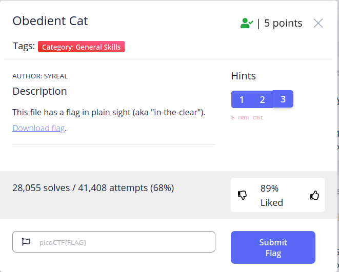

# Obedient Cat

## Introduction
Obedient Cat is the first exercise in the picoGym and is worth five points. The 
description states: "This file has a flag in plain sight (aka "in-the-clear")." 
A link is provided to download the flag.



## Solving
To solve the challenge, we first utilize the hints available to us.

### Hint 1
> Any hints about entering a command into the Terminal (such as the next one), 
will start with a '$'... everything after the dollar sign will be typed (or 
copy and pasted) into your Terminal.

Hint #1 informs us how to interpret future hints and how to read our terminal. 
Specifically it tells us focus on the characters that come after the `$`. The 
`$` (before a command) generally means that we are a regular user. Observe if 
you log in as a superuser, or `root` user, that the `$` will instead be 
replaced with a `#`. This comes from a POSIX standard and can be 
[traced][superuser] to the Bourne shell introduced in Version 7 Unix in 1979. 
The prompt value (whether `$`, `#`, or something else) can be found in the PS1 
environment variable. You can view the value of that variable by pasting the 
following in your terminal:

```
echo $PS1
```

Yours will look different, but mine is the following:
```
\[\e]0;\u@\h: \w\a\]👓\[\033[00m\]:\[\033[01;34m\]\w\[\033[00m\]\$
```

Ignore everything but the last character (primarily terminal color codes and my 
cool 👓 user). The last character is the `$`!

Why does `root` have a `#` instead of a `$`? The IEEE standard of the [Shell 
Command Language][scl] says the purpose is because "...a sufficiently powerful 
user should be reminded of that power by having an alternate prompt."

### Hint #2
> To get the file accessible in your shell, enter the following in the Terminal 
> prompt: `$ wget 
> https://mercury.picoctf.net/static/217686fc11d733b80be62dcfcfca6c75/flag`

`wget` is a network downloader that lives in your terminal. You can use it to 
download items on pages you visit, or just the whole HTML page. In this case, 
the hint is letting us know that we can download the flag with `wget`. Clicking 
on the link has the same effect.

### Hint #3
> `$ man cat`

This hint explicitly gives away one solution to obtaining this flag. The first 
command in this hint, `man`, short for manual, is a program that shows you 
information about reference manuals. It generally takes a specific page as an 
argument. In this case, the hint is pulling up the system reference manual for 
the `cat` executable program. `man`, also called "the man pages" is incredibly 
useful and you should use them throughout your CTF journeys. We won't talk 
about `man` much more, but for more information lookup the man page for `man` 
(`$ man man`).

The second command, `cat`, short for concatenate, is a program that is used to 
concatenate files and print the results to standard out. The most common way 
this is used is to simply read a file. You can do this by simply typing `cat 
<insert_filename_here>` in your terminal. You can also use it, as the name 
suggests, to concatenate multiple files together by adding another argument 
separated by a space `cat <insert_filename_here> <and_another_filename_here>`. 
There are lots of other things `cat` can do, like print out line numbers, show 
special hidden characters, and more. I would highly recommend following the 
hint and looking at the `man` page; this command will undoubtedly be one of 
your most commonly used ones.

## Solution
The description told us the flag was in plain sight and hint #3 told us to use 
the `cat` command. These two things together tell us to use the `cat` command 
on the downloaded file. In the terminal, we navigate to our downloaded file and 
run the following:
```
cat flag
```
We are then presented with the flag. Entering it on the picoGym gives us five 
points!
```
picoCTF{s4n1ty_v3r1f13d_b5aeb3dd}
```


[superuser]: 
https://superuser.com/questions/57575/what-is-the-origin-of-the-unix-dollar-prompt/57613#57613
[scl]: https://pubs.opengroup.org/onlinepubs/9699919799/xrat/V4_xcu_chap02.html#tag_23_02_05_03