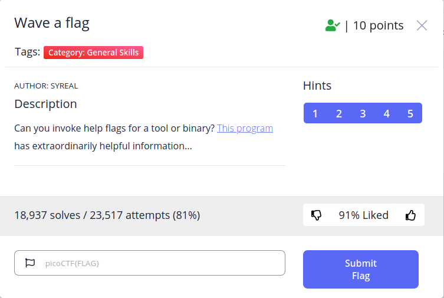
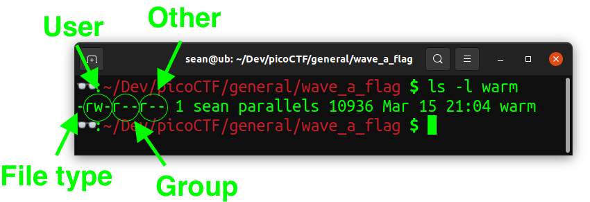

# Wave a Flag

## Introduction
Wave a Flag is the second challenge for in the General Skills category of the 
picoGym. The descriptions states: "Can you invoke help flags for a tool or 
binary? This program has extraordinarily helpful information..." A link is 
provided to download the flag.



## Solving
To solve the challenge, we first examine the 5 hints provided to us.

### Hint 1
> This program will only work in the webshell or another Linux computer.

We've been solving all of these challenges locally; no need to change now!

### Hint 2
> To get the file accessible in your shell, enter the following in the Terminal 
> prompt: `$ wget https://mercury.picoctf.net/static/a14be2648c73e3cda5fc8490a2f476af/warm`

In our write up of the first challenge, Obedient Cat, we talked about the 
`wget` program. We can again copy the command the hint provided into our 
terminal to download the challenge. Clicking on the link in the challenge does 
the same thing.

### Hint 3
> Run this program by entering the following in the Terminal prompt: `$ ./warm`,
> but you'll first have to make it executable with `$ chmod +x warm`.

When we first download this executable, we cannot run it. Running it in our 
terminal will result in a permissions error. Try it!

```
$ ./warm
bash: ./warm: Permission denied
```

We can examine the permissions that the executable has by running `ls -l`. The 
`ls` program is used to list directory contents and the `-l` flag specified 
that we want to see  the long listing format (with permissions!). Your output 
will look something like the following:

```
 ls -l warm 
-rw-r--r-- 1 sean parallels 10936 Mar 15 21:04 warm
```

We can interpret this output in the following way. The set of dashes and 
`r`/`w` characters represent the permissions. The first dash represents the 
type of file it is. Usually this is `d` or left as `-`. The `d` means it is a 
directory and the `-` means it's a normal file.

We can then chunk the remaining dashes into groups of three. The first set of 
three dashes represent the permissions for the user. In this case, the user 
`sean` has the ability to read and write to the file (`r` and `w` 
respectively). It is missing a `x` flag, so `sean` cannot execute this file.

The second group of three dashes represent the permissions for the group 
(`parallels` in this case). The final group of three represent the permissions 
for everyone else (commonly called world or other). This might be better 
explained as a picture:



### Hint 4
> `-h` and `--help` are the most common arguments to give to programs to get 
> more information from them!

This hint is directing us to pass in an argument to the program when we run it. 
Maybe `-h` is a good start!

### Hint 5
> Not every program implements help features like `-h` and `--help`.

Maybe not relevant for this challenge, but definitely worth noting.

## Solution
The description and hint 2 told us to download the program. We can do that with 
`wget`. Hint 3 tells us that we should make it executable with `chmod`. 
Finally, Hint 4 tells us to check out the help menu by passing in the `-h` flag.

Putting this all together:
```
wget https://mercury.picoctf.net/static/a14be2648c73e3cda5fc8490a2f476af/warm
chmod +x warm
./warm
```

If we don't pass in a `-h` flag, the program directs us to by outputting the 
following message:
```
Hello user! Pass me a -h to learn what I can do!
```

Doing that, we get the flag! Entering it on picoGym gives us 10 points.

```
$ ./warm -h
Oh, help? I actually don't do much, but I do have this flag here: picoCTF{b1scu1ts_4nd_gr4vy_755f3544}
```