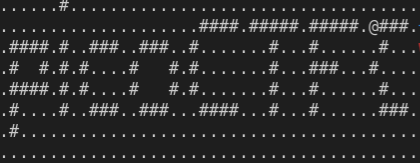

# Wizardlike

Wizardlike is a 500 point reversing problem for picoCTF 2022. It was the final
reversing challenge of the CTF. It was authored by LT 'syreal' Jones. The
description states:

> Do you seek your destiny in these deplorable dungeons? If so, you may want to
look elsewhere. Many have gone before you and honestly, they've cleared out the
place of all monsters, ne'erdowells, bandits and every other sort of evil foe.
The dungeons themselves have seen better days too. There's a lot of missing
floors and key passages blocked off. You'd have to be a real wizard to make any
progress in this sorry excuse for a dungeon! Download the game. 'w', 'a', 's',
'd' moves your character and 'Q' quits. You'll need to improvise some wizardly
abilities to find the flag in this dungeon crawl. '.' is floor, '#' are walls,
'<' are stairs up to previous level, and '>' are stairs down to next level.

We are given the following:

* `game`: amd64 binary that contains a terminal based game.

## Information Gathering

### Hint #1

Different tools are better at different things. Ghidra is awesome at static
analysis, but radare2 is amazing at debugging.

### Hint #2

With the right focus and preparation, you can teleport to anywhere on the map.

### Static Analysis

The first goal was to decompile the program with Ghidra. We honed in on the
functions that immediately followed the call to `wgetchar`. Each of them
checked for what direction the user entered. We labeled the functions
appropriately (it was missing the symbols).

```c
...
selection = wgetch();
if (selection == L'Q') {
    bVar1 = false;
}
else {
    if (selection == L'w') {
        up();
    }
    else {
        if (selection == L's') {
            down();
        }
        else {
            if (selection == L'a') {
                left();
            }
            else {
                if (selection == L'd') {
                    right();
                }
            }
        }
    }
}
...
```

Looking in each of these functions, we could see that the x and y positions
were being updated. We called them `x_pos` and `y_pos`. These were stored as
global variables at the addresses `0x555555573e70` and `0x555555573e74`
respectively (the base address being `0x555555554000`). We've copied the
disassembly of the function `up` here just to show how `y_pos` is being updated.

```c
void up(void)
{
  char cVar1;

  cVar1 = FUN_5555555555ac(x_pos,y_pos + -1);
  if (cVar1 != '\0') {
    if ((DAT_555555573e9c / 2 < y_pos) && (y_pos <= 100 - DAT_555555573e9c / 2)) {
      DAT_555555573e94 = DAT_555555573e94 + -1;
    }
    y_pos = y_pos + -1;
  }
  return;
}
```

Knowing these values, we could open the program with GDB and 'teleport' around
the map by setting the `x_pos` and `y_pos` whenever we wanted to. This allowed
us to get to places on the map that we otherwise could not see. Setting `x_pos`
to 10 and `y_pos` to 3 on the very first level teleported us to the otherwise
inaccessible room on the right side of the dungeon. Here, we can see the first
part of the flag printed as ascii art.



This is when we got the idea to just examine how the ascii art was printed. We
found function that looped over `i` and `j` capped at 100 each. Because the
value being passed to this function from `main` pointed to ascii characters
each of size ~100,000 bytes, we assumed that this function created the entire
map as a 100 x 100 grid. This turned out to be true.

void print_floor(char (*param_1) [10000])
{
  int i;
  int j;

  for (i = 0; i < 100; i = i + 1) {
    for (j = 0; j < 100; j = j + 1) {
      (&DAT_555555573ea0)[(long)i * 100 + (long)j] = (*param_1)[(long)j + (long)i * 100];
    }
  }
  return;
}

## Solution

We simply recorded all of the parameters to `print_floor` as they were called
in `main`. For example, the first floor was printed like the following and we
recorded the address of global variable `firstFloor`.

```c
if (currentFloor == 1) {
    FUN_555555555229();
    print_floor((char (*) [10000])firstFloor);
    x_pos = 2;
    y_pos = 1;
    DAT_555555573e90 = 0;
    DAT_555555573e94 = 0;
    DAT_555555573e78 = 1;
}
```

We placed all of these addresses inside of `solve.py` inside of a dictionary.
We then looped through each floor and printed out 100 characters per line for
100 lines. This gave us the same ascii art that we saw in the image above
dumped to `flag_art.txt`.

```txt
#########
#.......#  ......#...................................
#.......#  ....................####.#####.#####..###.
#........  .####.#..###..###..#.......#...#......#...
#.......#  .#  #.#.#....#   #.#.......#...###...#....
#.......#  .####.#.#....#   #.#.......#...#......#...
#.......#  .#....#..###..###...####...#...#......###.
#.......#  .#........................................
#.......#  ..........................................
#.......#
#.......#
#.......#
#.......#
#.......#
#......>#
#########
```

Looking at all ascii art in `flag_art.txt`, we pieced together the flag
`picoCTF{ur_4_w1z4rd_4B0DA5A9}`.
